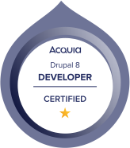
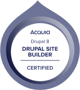

### 🚀 About Me:

  I’m Asghar Abbas — a Software Engineer with nearly a decade of experience building and managing web applications end-to-end. I’ve collaborated with global clients on projects of all sizes, leading development efforts and ensuring efficient, high-quality delivery.

  My expertise spans Drupal (7, 8, 9) and WordPress, covering both front-end and back-end development. As an Acquia Certified Drupal Developer, I’ve built secure, scalable systems using Paragraphs, Panels, and custom modules — including Node Delete Redirect, Folder Redirect, and User Info Widget, which are actively used by the Drupal community.

  Beyond Drupal, I’ve developed custom WordPress themes using Gutenberg blocks and Timber, complete with asset pipelines for SASS/JS compilation, minification, and versioning. On the infrastructure side, I manage DigitalOcean environments (Ubuntu, PHP, Certbot, load balancers), automate CI/CD pipelines with GitHub Actions, and handle DNS and Cloudflare configurations.

  I’ve also worked on a few MERN and Next.js projects, including FoodFlick — a white-label online ordering and POS platform I lead from concept to production (foodflick.app, app.foodflick.app).

  Currently, I lead and mentor developers, organizing work through GitHub Projects for clear planning and delivery. I’m passionate about bridging development, infrastructure, and product thinking to create systems that are not just functional — but dependable and thoughtfully designed.

  

  
  <!--   --> 
   <a href="https://github.com/devasghar/">

<!--Languages and Tools Section-->       
<h2 align="center">Lᴀɴɢᴜᴀɢᴇs ᴀɴᴅ Tᴏᴏʟs</h2> 

  
  
  
  
   
  
  
  
  
   
  
  
  
  
   
  
  
  
  
   
  
  
  
   
  

<h2 align="center">⚡ Stats ⚡</h2>
 

  

<!--Footer--> 

  

